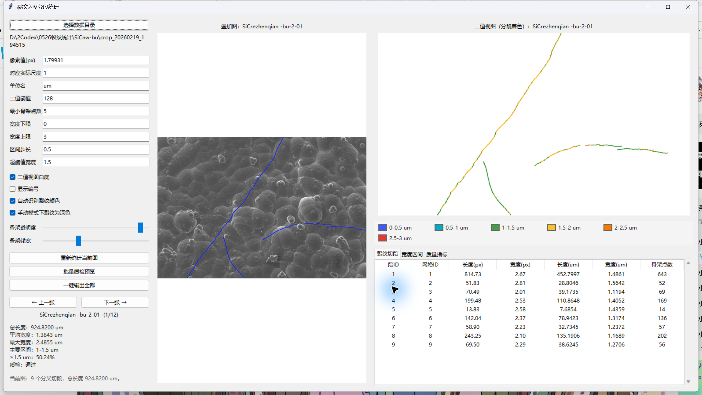

# Crack Width Statistics



Crack Width Statistics is a desktop application for measuring crack length and
local width distributions from binarized microscopy images. It converts each
crack region into a one-pixel-wide skeleton, measures centerline length with
8-neighborhood geometry, estimates local width from the Euclidean distance to
the crack boundary, and exports publication-oriented statistics to Excel.

The graphical interface supports image-by-image inspection, width-bin coloring,
segment and width-bin highlighting, zooming and panning, quality-control
metrics, and batch preview generation. No programming is required when using
the Windows executable.

## Main Features

- Skeletonizes binarized crack regions into one-pixel-wide centerlines.
- Measures horizontal and vertical links as `1 px` and diagonal links as
  `sqrt(2) px`.
- Estimates local crack width as `2 * distance_to_boundary` at each skeleton
  location.
- Creates user-defined width intervals from a lower bound, upper bound, and
  step size. For example, `0`, `3`, and `0.5` produce six intervals from
  `0-0.5` through `2.5-3`.
- Reports length-weighted mean, median, P10, P90, maximum, and standard
  deviation of crack width.
- Reports the fraction of total crack length whose local width is greater than
  or equal to a user-defined threshold.
- Splits branching crack networks into reviewable segments while preserving
  the merged-network total length.
- Reports width-bin length, percentage, cumulative percentage, above-bin
  percentage, and skeleton-point count.
- Provides quality-control indicators for crack area, skeleton points,
  filtered short networks and segments, endpoints, branch points, isolated
  points, and width values outside the selected range.
- Highlights a selected crack segment or selected width interval in both image
  previews.
- Supports mouse-wheel zoom, drag-to-pan, double-click reset, skeleton opacity,
  and line-width controls.
- Exports per-image and global Excel summaries, overlay images, width-colored
  skeleton images, and a batch quality-preview sheet.

## Download the Windows Application

Download the latest `CrackWidthStatistics-*-windows-x64.exe` file from the
[GitHub Releases page](https://github.com/Diabolus0302/crack-width-statistics/releases/latest).

The executable is portable and does not require a Python or Conda installation.
Windows may display a reputation warning for unsigned research software; verify
that the file was downloaded from this repository and compare its SHA-256 hash
with the value published in the release notes.

## Quick Start

1. Arrange the input data as shown below. The names `原图` and `二值化图` are
   required by the current application.
2. Start the executable, or run `python src/crack_width_app.py` from the Conda
   environment.
3. Click **Select data directory** (`选择数据目录`) and choose the parent folder
   containing both image subfolders.
4. Confirm the image scale, threshold, minimum skeleton size, width range,
   interval step, and over-threshold width.
5. Click **Recalculate current image** (`重新统计当前图`) after changing a
   numeric parameter.
6. Review the overlay, width-colored skeleton, summary, segment table,
   width-interval table, and quality-control table.
7. Click **Export all** (`一键输出全部`) to process the complete dataset.

See the [English User Guide](docs/USER_GUIDE.md) for parameter definitions,
interactive controls, output-sheet descriptions, formulas, and quality-control
interpretation.

## Input Data Layout

```text
dataset/
|-- 原图/
|   |-- image_01.png
|   `-- image_02.png
|-- 二值化图/
|   |-- image_01.png
|   `-- image_02.png
`-- scale_info.txt                 # optional
```

The files in `二值化图` are the measurement input. Files with exactly the same
file name in `原图` are used for the visual overlay. Supported formats are
TIFF, PNG, JPEG, and BMP.

An optional UTF-8 `scale_info.txt` can provide the scale automatically:

```text
Unit: um
Pixels Per Unit: 1.79931
```

If the file is absent, the values can be entered directly in the interface.

## Measurement Summary

For every pair of adjacent skeleton pixels, the program adds `1 px` for a
horizontal or vertical connection and `sqrt(2) px` for a diagonal connection.
The physical conversion factor is:

```text
physical units per pixel = corresponding physical width / pixel value
```

Local width is estimated at every retained skeleton location by applying a
Euclidean distance transform to the binary crack mask and multiplying the
centerline-to-boundary distance by two. Width summaries are length-weighted, so
each local width contributes in proportion to the centerline length represented
by that skeleton location.

Width bins use `[lower, upper)` boundaries, except the final interval, which
includes its upper boundary. The over-threshold statistic uses
`local width >= threshold`.

## Install from Source

Create and activate the Conda environment:

```bat
conda env create -f environment.yml
conda activate crack_width_stats
python src\crack_width_app.py
```

To rebuild the Windows executable in a clean local environment:

```bat
build_exe_slim.bat
```

The generated file is `dist\CrackWidthStatistics.exe`. The slim build excludes
unused plotting, notebook, GUI-framework, computer-vision, and scikit-image
submodules while retaining the packages required by this workflow.

## Repository Layout

```text
.
|-- src/
|   `-- crack_width_app.py
|-- data/
|   `-- README.md
|-- docs/
|   |-- software-screenshot.png
|   `-- USER_GUIDE.md
|-- AUTHORS.rst
|-- CHANGELOG.md
|-- CITATION.cff
|-- LICENSE
|-- environment.yml
|-- requirements.txt
|-- build_exe_slim.py
|-- build_exe_slim.bat
`-- run_app.bat
```

## Authors

Bing Liu, Jia Sun, Lingxiang Guo, Yujia Zhang, Yihao Ding, Tianyu Liu, Laura
Feldmann, Xuemin Yin, Dou Hu, Yang Xu, Ralf Riedel, and Qiangang Fu.

## Citation

If this software contributes to published work, please cite the associated
manuscript and the archived software release used in the analysis. GitHub can
read the repository metadata directly from [CITATION.cff](CITATION.cff).

## License

This project is distributed under the [MIT License](LICENSE).
